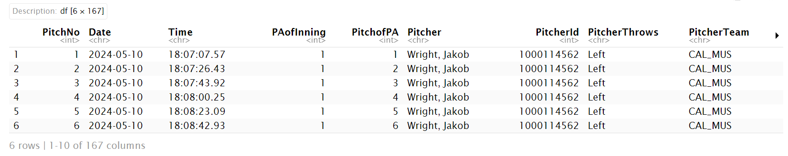
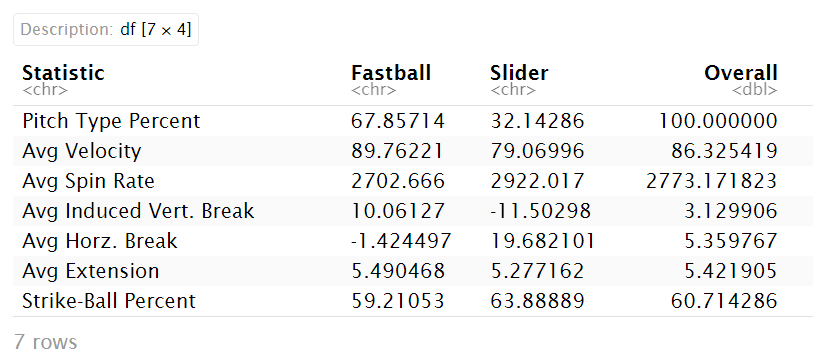
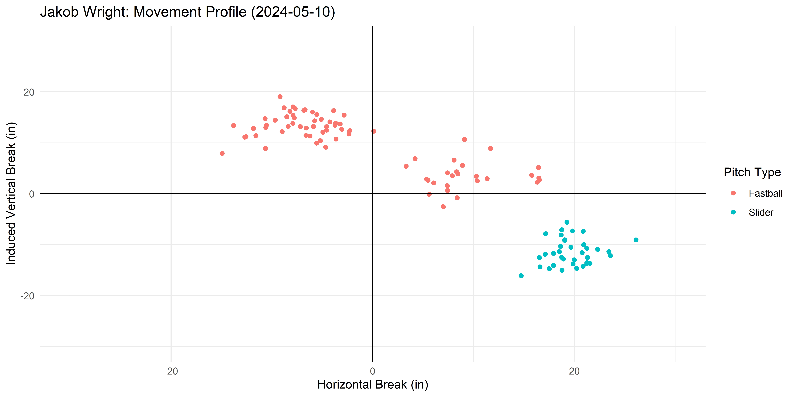
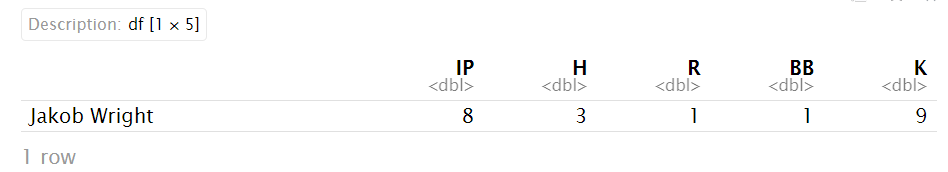

# trackmanbaseballr

The `trackmanbaseballr` package was created to generate visual and numeric summaries of pitchers in college baseball game data collected and stored by [TrackMan Baseball](https://www.trackman.com/baseball).

This package can be installed by running:

```{r}
remotes::install_github("DanielErro35/trackmanbaseballr")
```

### Examples

First, load the `trackmanbaseballr` library:
```{r}
library(trackmanbaseballr)
```
Read in a trackman baseball dataset:
```{r}
poly_utah_game <- read.csv(here::here("5-10-24_CalPoly_UtahTech.csv"))
```
Let's see what the first few rows and columns should look like:
```{r}
head(poly_utah_game)
```



Generate numeric summaries of a baseball game for a specified pitcher

```{r}
pitcher_summary(data = poly_utah_game, pitcherid = 1000114562)
```


Generate a movement chart for a specified pitcher to show horizontal and induced vertical breaks of each pitch

```{r}
pitcher_chart(data = poly_utah_game,
              pitcherid = 1000114562,
              type = "movement")
```


Generate numeric summaries of box scores for a specified pitcher

```{r}
pitcher_box_score(data = poly_utah_game,
                  pitcherid = 1000114562)
```

